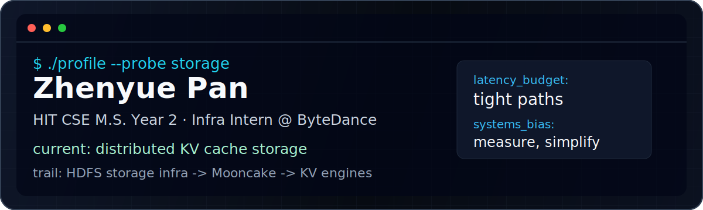

<p align="center">
  
</p>

# Zhenyue Pan

`HIT CSE M.S. Year 2` · `AI Infra Intern @ ByteDance` · `Machine Learning Systems / Storage`

```txt
zhenyue@hit:~$ ./profile --status

school    Harbin Institute of Technology, M.S. Year 2
role      infra intern @ ByteDance
current   distributed KVcache storage for LRM
trail     HDFS storage infra -> KV engines for LRM
bias      fewer layers, tighter paths, measurable latency
```

## Worklog

- [kvcache-ai/Mooncake](https://github.com/kvcache-ai/Mooncake/pull/2114): fixed Mooncake Store Rust standalone build path and native dependency resolution.
- [apache/inlong](https://github.com/apache/inlong/pull/11999): audit alert evaluation and periodic audit checks.
- [NyxDB](https://github.com/ZhenyuePan/NyxDB): distributed KV engine with Bitcask-style logs, Raft, and gRPC.

## Contact

`mail -s hello 664945264@qq.com`
